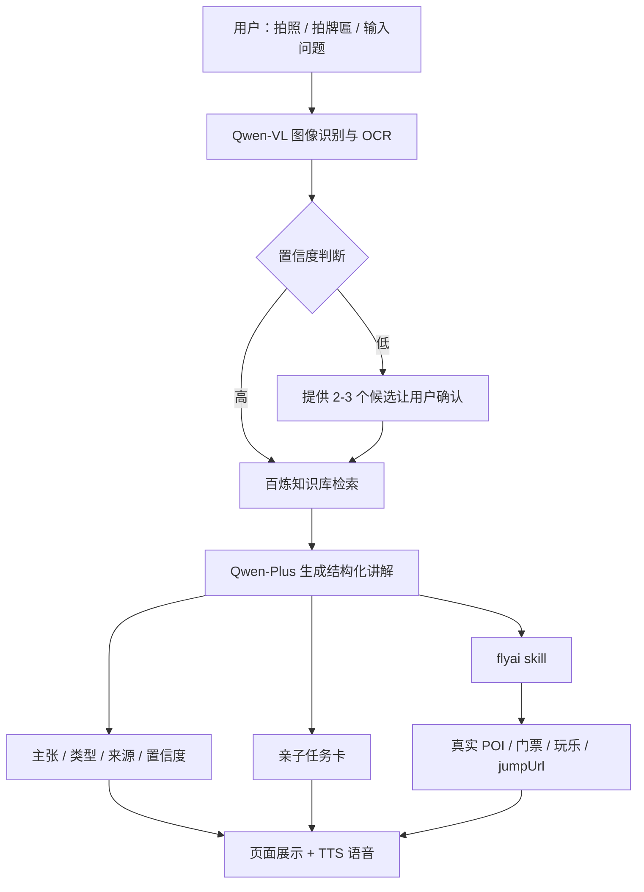

# 随行讲解员

> 拍一张照片，听懂一座城。  
> 2026 飞猪 AI 旅行创新大赛参赛作品｜赛道：AI 私人讲解员

[](#技术架构)
[](#技术架构)
[](#项目状态)

> **项目状态**：开发中。核心功能在阿里云百炼 Managed Agent 上搭建，本仓库用于保存提示词、知识库、测试用例、演示材料和提交材料。

---

## 30 秒快速了解

「随行讲解员」面向自由行游客、亲子家庭和入境游客。

你只需要拍一张照片，它就能：

1. **拍景讲景**：识别景点、建筑、文物和展品。
2. **拍牌匾/说明牌解读**：OCR 识别文字，解释古文字、牌匾含义或外文说明。
3. **结构化讲解**：输出主张、类型、来源和置信度，区分【史实】【传说】【待考证】。
4. **不确定就让用户选**：低置信度时提供 2–3 个候选，而不是硬猜。
5. **亲子任务卡**：讲解完自动生成 3 个问题和 1 个寻宝任务。
6. **行动闭环**：通过飞猪 FlyAI 查询附近 POI、门票和玩乐，并给出 `jumpUrl`。

## 演示视频

【待补：3 分钟演示视频链接】

## 核心截图

| 功能 | 截图 |
|---|---|
| 太和殿识别 + 3 分钟讲解 | 【待补】 |
| 史实/传说/待考证 + 来源 | 【待补】 |
| 拍牌匾 OCR 解读 | 【待补】 |
| 亲子任务卡 | 【待补】 |
| FlyAI 附近推荐 + jumpUrl | 【待补】 |

## 核心亮点

| 亮点 | 说明 |
|---|---|
| 多模态输入 | 拍照、牌匾 OCR、文字输入 |
| 可验证内容 | 每条关键信息包含类型、来源、置信度 |
| 低置信度兜底 | 识别不确定时提供候选让用户确认 |
| 亲子互动 | 讲解后生成任务卡，适合家庭游客 |
| 真实旅行数据 | 通过 flyai skill 查询真实 POI、门票、玩乐 |
| 多语言 | 中文为主，支持入境游客常见语言 |

## 技术架构



## 结构化讲解格式

```json
{
  "landmark": {
    "name": "北京故宫·太和殿",
    "confidence": 0.96,
    "evidence": "重檐庑殿顶、三层汉白玉基座"
  },
  "guide": {
    "duration": "3min",
    "tone": "标准版",
    "language": "zh-CN"
  },
  "claims": [
    {
      "text": "太和殿是中国现存最大的木结构大殿。",
      "type": "史实",
      "source": "故宫博物院官网",
      "confidence": "高"
    }
  ],
  "family_task": {
    "questions": [
      "太和殿的屋顶和普通房子有什么不同？",
      "为什么皇帝的重要典礼要在这里举行？"
    ],
    "mission": "找到屋脊上的小兽，数一数有几只。"
  },
  "next_stop": {
    "name": "景山公园",
    "jumpUrl": "https://..."
  }
}
```

## 快速体验

【待补：百炼 Agent 分享链接】

## 复现步骤

1. 登录[阿里云百炼](https://bailian.console.aliyun.com/)，在模型广场选择 **Managed Agent**。
2. 新建智能体，选择 **Qwen-VL** 等多模态模型。
3. 粘贴 [`prompts/system-prompt.md`](prompts/system-prompt.md) 中的系统提示词。
4. 安装飞猪官方 Skill：

```bash
npx skills add alibaba-flyai/flyai-skill
```

5. 申请 FlyAI API Key，并配置环境变量：

```bash
FLYAI_API_KEY=你的APIKey
```

6. 将 [`knowledge/`](knowledge/) 中的景点资料导入百炼知识库。
7. 按 [`docs/test-cases.md`](docs/test-cases.md) 逐项验证。

## 测试结果

| 指标 | 当前结果 | 目标 |
|---|---|---|
| 3 个 MVP 景点识别准确率 | 【待补】 | ≥ 90% |
| 结构化讲解完整率 | 【待补】 | ≥ 95% |
| 平均响应时间 | 【待补】 | ≤ 8 秒 |
| FlyAI 真实查询成功率 | 【待补】 | ≥ 90% |
| 亲子任务卡可用率 | 【待补】 | ≥ 90% |

## 项目结构

```text
.
├── README.md
├── LICENSE
├── .env.example
├── prompts/
│   └── system-prompt.md
├── knowledge/
│   ├── README.md
│   ├── _template.md
│   ├── 故宫太和殿.md
│   ├── 秦始皇兵马俑.md
│   └── 杭州西湖.md
├── docs/
│   ├── agent-setup.md
│   ├── architecture.md
│   ├── demo-spots.md
│   ├── issue-169-submission.md
│   ├── test-cases.md
│   └── video-script.md
└── screenshots/
```

## 百炼使用说明

- **模型/能力**：Qwen-VL（图像识别与 OCR）、Qwen-Plus（结构化讲解与追问）
- **调用方式**：阿里云百炼 Managed Agent
- **使用环节**：
  - Qwen-VL：识别图片中的景点、建筑、文物、牌匾文字
  - Qwen-Plus：结合知识库生成结构化讲解、亲子任务卡、多语言回答
  - 百炼知识库：提供可核验的事实来源
- **Skill**：flyai（`alibaba-flyai/flyai-skill`），用于查询真实旅行数据

## 已知限制

- 知识库目前优先覆盖 3 个 MVP 景点：故宫太和殿、秦始皇兵马俑、杭州西湖。
- 其他景点会输出【待考证】或建议用户查询官方资料。
- 图片识别受拍摄角度、光线和遮挡影响，不保证 100% 正确。
- 历史讲解仅用于旅行科普，专业研究请以景区官方和学术资料为准。

## Roadmap

- [ ] 3 个 MVP 景点跑通完整链路
- [ ] 增加拍牌匾/说明牌 OCR 解读
- [ ] 增加亲子任务卡
- [ ] 增加低置信度候选选择
- [ ] 接入 flyai skill 和真实门票查询
- [ ] 扩展至 10 个测试景点
- [ ] 补齐截图、演示视频和测试指标
- [ ] 填写 Issue #169 并提交

## 参考

- [2026 飞猪 AI 旅行创新大赛官网](https://opc.aliyun.com/feizhu)
- [飞猪 AI 开放平台](https://flyai.open.fliggy.com/)
- [飞猪官方 flyai skill](https://github.com/alibaba-flyai/flyai-skill)
- [阿里云百炼](https://bailian.console.aliyun.com/)

## License

MIT
