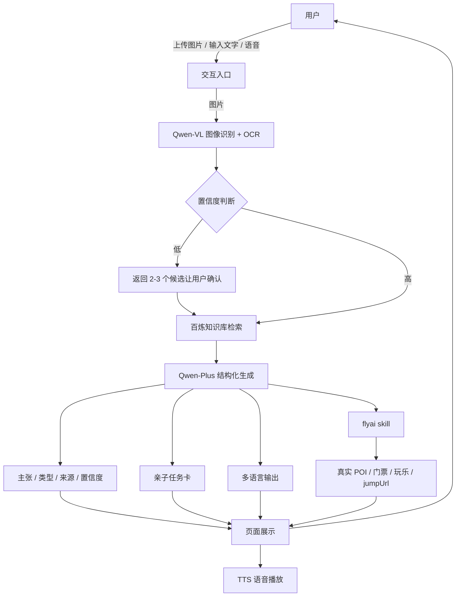

# 架构说明

## 目标

用最低的工程成本，把「拍照 → 识别 → 可验证讲解 → 亲子任务 → FlyAI 行动建议」做成一条稳定链路。

## 总体架构



## 模块职责

| 模块 | 职责 |
|---|---|
| 交互入口 | 接收图片、文字、语音；展示讲解、来源、任务卡和下一站 |
| Qwen-VL | 识别景点/建筑/文物；读取牌匾、说明牌、外文标识 |
| 置信度判断 | 高置信度直接讲解；中低置信度先确认候选 |
| 百炼知识库 | 提供可核验的事实内容、来源和亲子任务素材 |
| Qwen-Plus | 生成结构化讲解、追问回答、多语言版本 |
| flyai skill | 查询真实 POI、门票、玩乐、价格和 `jumpUrl` |
| TTS | 把讲解转成语音，适合边走边听 |
| 缓存层 | 按图片 hash 和景点 ID 缓存，降低延迟和 Token 消耗 |

## 结构化输出

Agent 内部先组织为结构化数据，再渲染成用户可读的 Markdown：

```json
{
  "landmark": {
    "name": "北京故宫·太和殿",
    "confidence": 0.96,
    "evidence": ["重檐庑殿顶", "三层汉白玉基座"]
  },
  "guide": {
    "duration": "3min",
    "tone": "标准版",
    "language": "zh-CN"
  },
  "claims": [
    {
      "text": "太和殿是中国现存最大的木结构大殿。",
      "type": "史实",
      "source": "故宫博物院官网",
      "confidence": "高"
    }
  ],
  "family_task": {
    "mission": "找到屋脊上的小兽，数一数有几只。",
    "questions": [
      "太和殿的屋顶和普通房子有什么不同？",
      "为什么皇帝的重要典礼要在这里举行？"
    ]
  },
  "next_stop": {
    "name": "景山公园",
    "reason": "可以俯瞰故宫中轴线",
    "jumpUrl": "https://..."
  }
}
```

## 置信度策略

| 置信度 | 行为 |
|---|---|
| 高 | 直接讲解 |
| 中 | 先说明“可能识别为”，再讲解，并允许用户纠正 |
| 低 | 不讲解，给出 2–3 个候选让用户确认 |
| 无法识别 | 明确说明无法识别，请用户补充城市/景区/清晰照片 |

## 异常与降级

1. **图片识别失败**：请用户换图或补充文字地点。
2. **知识库无资料**：标注【待考证】，不编造，建议查官方资料。
3. **FlyAI 无结果**：返回缓存结果或引导用户换个说法。
4. **接口超时**：先展示已缓存讲解，再异步补实时推荐。
5. **Token 或额度不足**：优先使用缓存，保证演示链路不断。

## 缓存设计

- 图片识别：按图片 hash 缓存识别结果。
- 讲解内容：按 `景点 ID + 时长 + 语气 + 语言` 缓存。
- FlyAI 结果：按 `城市 + 关键词 + 日期` 缓存 10–30 分钟。
- 演示兜底：为 3 个 MVP 景点准备离线结果。

## 安全与合规

- 不把 `FLYAI_API_KEY` 写进前端或 GitHub。
- 宣传截图和视频中避免出现 API Key、个人信息和未授权素材。
- 知识库优先使用官方、公开、可引用的资料。
- 历史讲解只用于旅行科普，专业问题建议咨询官方或持证导游。

## 可量化指标

| 指标 | 说明 |
|---|---|
| 识别准确率 | 3 个 MVP 景点测试集中的正确识别比例 |
| 结构化完整率 | 输出中包含主张/类型/来源/置信度的比例 |
| 平均响应时间 | 从上传图片到首段讲解出现的时间 |
| FlyAI 成功率 | 查询有真实返回并带 `jumpUrl` 的比例 |
| 亲子任务可用率 | 生成任务卡且问题合理的比例 |
